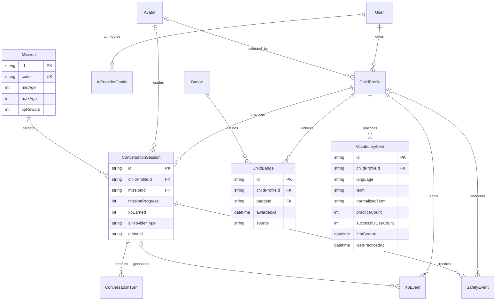

# MVP Domain Model

Phase 3 evolves the Phase 2 schema; it does not introduce CRUD endpoints or connect
the existing frontend to PostgreSQL. Phase 4 adds the functional backend while
preserving that schema and leaving frontend integration deferred. The authoritative schema is
`apps/api/prisma/schema.prisma` and its ordered migration history.

## Entities

| Entity              | Responsibility                                                                                                                           |
| ------------------- | ---------------------------------------------------------------------------------------------------------------------------------------- |
| User                | Adult account, adult email and display alias; owns child profiles.                                                                       |
| ChildProfile        | Child alias, integer age, age band, languages, selected avatar and basic cached progress. No birth date or child email.                  |
| Avatar              | Reusable avatar catalog, personality, visual style and active flag.                                                                      |
| Mission             | Mission catalog with inclusive `minAge`/`maxAge`, estimated XP reward, order and active flag.                                            |
| ConversationSession | One child's practice with optional mission/avatar; mode, status, progress, XP summary, provider/model snapshot and start/end timestamps. |
| ConversationTurn    | Ordered safe text turns, role, input mode, optional gentle correction and per-turn XP summary. No separate Correction entity.            |
| XpEvent             | XP ledger entry with reason, optional source and optional originating session.                                                           |
| Badge               | Badge definition, icon and optional XP criterion; not proof that a child earned it.                                                      |
| ChildBadge          | Explicit award joining a child to a badge, with award time and optional source.                                                          |
| VocabularyItem      | Per-child, per-language practiced term, normalized key, practice/success counters and first/last practice times. No AI mastery score.    |
| AiProviderConfig    | Adult-scoped provider type, base URL, model and active flag. No credentials.                                                             |
| SafetyEvent         | Minimal category, action, reason code, severity and optional child/session references. No raw input snippet.                             |

## Relationships

## Invariants

Database-enforced:

- Adult emails and catalog codes are unique; child aliases are unique within an adult account.
- A child can receive a badge once: unique `(childProfileId, badgeId)`.
- Vocabulary is unique by `(childProfileId, language, normalizedTerm)`.
- Mission eligibility is inclusive: `5 <= minAge <= maxAge <= 12`.
- Mission progress is an integer percentage from 0 to 100.
- Vocabulary requires `practiceCount >= 1`, `0 <= successfulUseCount <= practiceCount`,
  a nonempty normalized term and `firstSeenAt <= lastPracticedAt`.
- Foreign keys preserve ownership references. Child deletion cascades to sessions,
  turns, XP, awards and vocabulary. Deleted sessions detach XP references instead
  of discarding the ledger. Optional avatar/mission references use `SET NULL`.
- Safety references use `SET NULL`, preserving metadata without retaining the deleted child's ID.

The numeric and date checks are explicit PostgreSQL CHECK constraints in the Phase 3
migration. Prisma cannot represent these in its schema DSL. Keep them in migration
history, test them with `pnpm test:db`, and review future migrations for their preservation.

Application-enforced in Phase 4:

- Child ages must be 5-12; `ageBand` must match age. A child must be eligible before starting a mission.
- Modes, statuses, turn roles, input modes and provider types use the shared contracts;
  strings remain in the database to evolve the existing MVP without premature enums.
- XP/safety events linked to a session must reference that session's child. Separate
  foreign keys do not enforce this cross-entity condition; services must validate it.
- Update XP ledger and cached totals in one transaction. `xpTotal` equals the sum of
  the child's XP ledger; `xpEarned` equals the sum of that session's XP events.
  Turn `xpAwarded` is a presentation summary, not an additional award to count.
- Award badges from their actual criteria; `xpRequired` alone does not imply a mission
  or streak badge. Awards are authoritative, not inferred on every read.
- Normalize vocabulary with shared `normalizeVocabularyTerm`: NFKC, trim, collapse
  whitespace, lowercase. This MVP helper targets English; language-specific rules can follow.
- Only persist safe conversation text. Screen/redact unsafe or personal input before
  storing a turn or correction; use controlled metadata codes for safety events.
- `baseUrl` and `model` must not contain embedded credentials or personal data.

## Source of Truth

Progress reads combine ChildProfile, ConversationSession, XpEvent, ChildBadge and
VocabularyItem. There is deliberately no `LearningProgress` table.

- XP: XpEvent ledger; profile/session totals are rebuildable caches.
- Missions: completed sessions, `missionId` and `missionProgress`, not a duplicate completion counter.
- Badges: ChildBadge award records joined to Badge definitions.
- Vocabulary: observed counters and timestamps, never generated mastery estimates.
- Learning proficiency: ChildProfile.level is starter/explorer/hero, exposed as
  learningLevel. It is not an XP cache or gamification level and never changes from XP.
- Streak: existing cached streakDays; timezone-aware recalculation remains deferred.
- Provider selection: adult-scoped AiProviderConfig is authoritative; only Mock runtime
  is registered. Invalid/unsupported selection fails explicitly, without fallback.
- Live mission strategy: isolated deterministic three-step engine, 0/33/67/100;
  completion reward and explicit awards remain server-authoritative.

## Demo History

The seed reuses shared avatar, profile and mission definitions. One transaction
upserts records using existing natural keys and stable child-derived session/turn/XP IDs.
Repeated runs replace fixture values rather than incrementing counters or creating awards.
Existing unrelated records are not deleted. The seed is for demo development, not production.

| Child        | Sessions | Turns | XP events | Demo XP | Badges                                    | Vocabulary            |
| ------------ | -------- | ----- | --------- | ------- | ----------------------------------------- | --------------------- |
| Sofia, age 9 | 3        | 18    | 11        | 120     | First Talk, Animal Explorer, 3 Day Streak | dog, cat, bird, hello |
| Leo, age 6   | 1        | 4     | 3         | 35      | First Talk                                | hello, dog            |

Historical practice is fixed at May 16-18, 2026 UTC. Sofia's streak of 3 and Leo's
streak of 1 describe the fixture's last practice date, not an active streak today.
Completion XP uses the mission catalog reward; practice XP is deterministic fixture
data, not the future reward algorithm. Safe corrections are demonstrated on one turn.
Vocabulary counts one occurrence per child turn and treats a corrected turn as
unsuccessful; avatar prompts do not count. The target vocabulary subset is explicit.

Profile XP caches include all existing ledger events, not only demo entries.
`pnpm db:verify` checks relationships, counters, timestamps and XP reconciliation;
its fingerprint excludes mutable `updatedAt` fields but includes persistent IDs.
The PostgreSQL suite runs the seed twice and compares that fingerprint.

## Migration Notes

`20260519230000_init` remains unchanged.
`20261005210000_phase3_domain_model` adds the new tables and fields in one transaction.
Known mission codes receive the reviewed ranges. Other numeric `ageBand` ranges
are parsed and validated; invalid custom ranges abort without partial changes.
Existing sessions/turns retain IDs and receive zero progress/text-mode defaults.
Existing XP events retain IDs and receive a null session reference; no historical
link is guessed. Legacy safety records receive `category=legacy`, `action=unknown`;
their raw `inputSnippet` column is intentionally dropped. Existing raw conversation
content is not retroactively screened by this schema migration.

Review legacy safety `reason` values for raw personal/unsafe text before deploying
to any non-demo database. No raw audio field or API credential field is introduced.
Take a backup before applying migrations to any database that matters.
